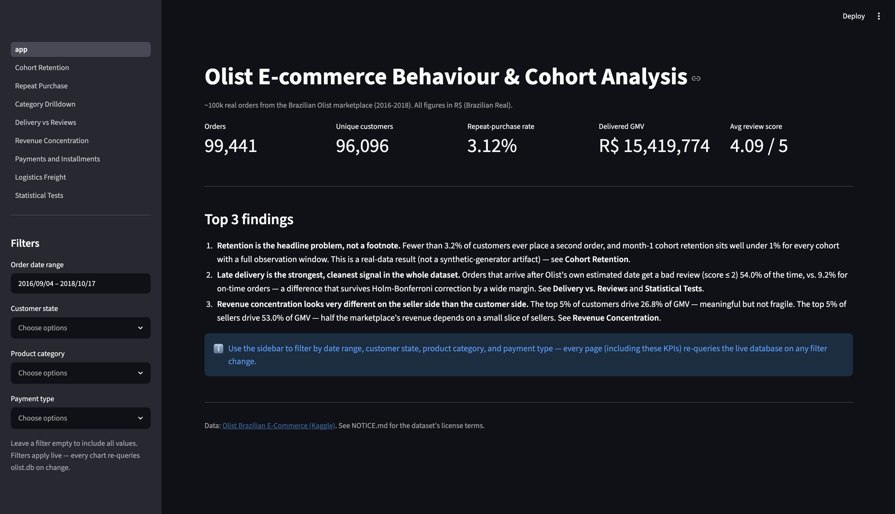
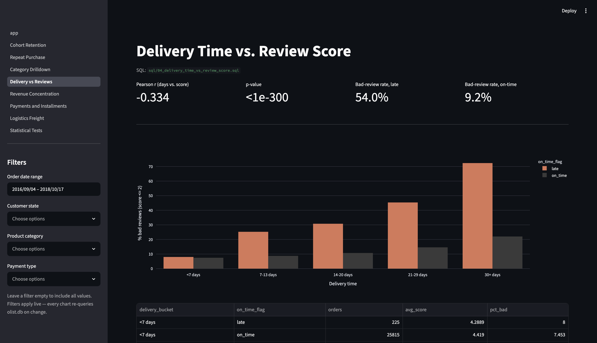
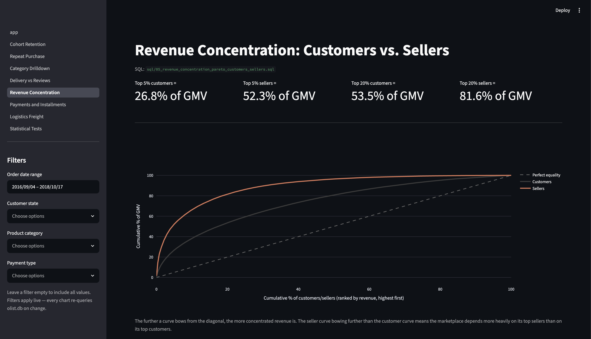
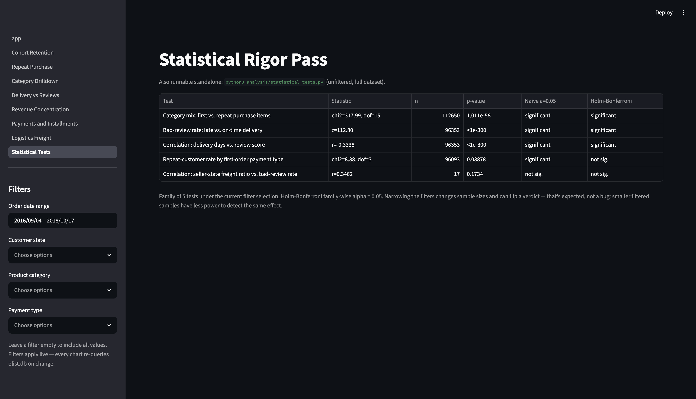

# Olist Marketplace Retention Deep-Dive

[](https://github.com/shreyanshverma7/olist-marketplace-retention-deep-dive/actions/workflows/ci.yml)
[](LICENSE)
[](requirements.txt)
[](https://olist-marketplace-retention-deep-dive.streamlit.app/)

**[Try the live dashboard →](https://olist-marketplace-retention-deep-dive.streamlit.app/)**

I analysed 99,441 real orders from Olist, a Brazilian e-commerce marketplace (2016-2018), to size the retention problem, quantify what actually predicts a bad review, and find where marketplace revenue is structurally concentrated. Unlike a synthetic dataset, every effect below is real -- genuinely present in real customer behaviour, not manufactured by a data generator.

## Top 3 findings

1. **Retention is the headline problem, not a footnote.** Only 3.12% of the 96,096 unique customers ever place a second order. Among cohorts with a full observation window, month-1 retention sits well under 1% -- e.g. the Jan-2017 cohort returns at 0.39% in month 1. This is a real-data result: nothing in the schema forces it.
2. **Late delivery is the strongest, cleanest signal in the entire dataset.** Orders that arrive after Olist's own estimated delivery date get a bad review (score ≤ 2) **54.0%** of the time, vs. **9.2%** for on-time orders (two-proportion z = 112.80, p < 1e-300) -- a result that survives Holm-Bonferroni correction by a wide margin. Delivery days correlate with review score at r = -0.33 (n = 96,353).
3. **The marketplace depends far more on its top sellers than its top customers.** The top 5% of customers drive 26.8% of GMV -- meaningful but not fragile. The top 5% of sellers drive **52.3%** of GMV, and the top 20% drive 81.6%. Losing a handful of top sellers would hurt this marketplace far more than losing its biggest customers.

**Recommendation, prioritized and quantified:**

1. **Fix delivery-estimate accuracy and late-shipment logistics first.** It's the single largest, most statistically robust lever on satisfaction found in this analysis -- a 44.8-point swing in bad-review rate (54.0% vs. 9.2%) between late and on-time orders, on a sample of 96k+ orders. Target the highest-freight-ratio seller states first (CE, ES, GO, DF all sit above a 0.36 freight/price ratio -- see [Logistics](#7-freight-cost-concentration-by-region--sqlfreight_cost_ratio_by_regionsql)), since they're the likeliest source of delivery delay.
2. **Build a second-purchase program, not just an acquisition funnel.** With repeat-purchase rate at 3.12% and a median 27.9 days between 1st and 2nd order, there's a real but narrow window to re-engage a first-time buyer before they're gone for good. `bed_bath_table` customers are the strongest repeat-purchase segment (15.06% share of repeat-purchase items vs. 9.68% of first-purchase items) -- a natural place to pilot a win-back campaign.
3. **Treat seller concentration as a platform risk, not just a revenue fact.** At 52.3% of GMV from the top 5% of sellers, a seller-retention/diversification program is a bigger structural priority than deepening the customer base, where revenue is comparatively well spread (top 5% of customers = only 26.8% of GMV).

## Data

The [Olist Brazilian E-Commerce dataset](https://www.kaggle.com/datasets/olistbr/brazilian-ecommerce) (Kaggle, CC BY-NC-SA 4.0 -- see [NOTICE.md](NOTICE.md)): real, anonymised orders from Olist's marketplace, September 2016 - October 2018.

| Table | Rows | Grain |
|---|---:|---|
| `orders` | 99,441 | one row per order |
| `customers` | 99,441 | one row per **order's** customer_id (see gotcha below) |
| `order_items` | 112,650 | one row per line item |
| `order_payments` | 103,886 | one row per payment leg (an order can be split across methods) |
| `order_reviews` | 99,224 | one row per review |
| `products` | 32,951 | one row per product |
| `sellers` | 3,095 | one row per seller |
| `customer_order_seq` | 99,441 | precomputed: this order's sequence number for this customer |

`geolocation.csv` (the 9th Kaggle file) is intentionally **not loaded** -- `customers`/`sellers` already carry `customer_state`/`seller_state` directly, which is all the region filtering in this project needs, and geolocation is by far the largest file (~1M rows of zip-code lat/long) for no analytical value here.

**All amounts are in R$ (Brazilian Real)**, kept native rather than converted, to avoid defending a stale FX rate.

### The `customer_id` vs. `customer_unique_id` gotcha

Olist's schema gives **every order a new `customer_id`** -- it is not a stable customer key. `customer_unique_id` is the real person, and is what every cohort, repeat-purchase, and "first vs. repeat" query in this project groups by. Getting this backwards silently makes every customer look like a one-time buyer (which is exactly what a naive first pass at this dataset produces). 96,096 unique people placed 99,441 orders.

## The 7 questions

### 1. Monthly cohort retention triangle — [`sql/01_monthly_cohort_retention.sql`](sql/01_monthly_cohort_retention.sql)

Month-1 retention by signup cohort (cohorts restricted to 2017-01 – 2018-08, each with a full or near-full observation window before the dataset ends):

| Cohort | Cohort size | M+1 | M+6 | M+12 |
|---|---:|---:|---:|---:|
| 2017-01 | 764 | 0.39% | 0.13% | 0.79% |
| 2017-06 | 3,245 | 0.28% | 0.31% | 0.15% |
| 2018-01 | 7,269 | 0.26% | -- | -- |

*(Full triangle in the [dashboard](#interactive-dashboard-streamlit) and reproducible via the SQL file -- every cohort's numbers are this low; there is no month-1 outlier above ~1%.)*

**Caveat:** the dataset's last order is 2018-10-17, so cohorts near the right edge have had less time to show a repeat purchase (right-censoring). Only cohorts at the same `month_number` are comparable, and the SQL file computes `months_observable` per cohort so this isn't guesswork.

### 2. Repeat-purchase rate & time to 2nd order — [`sql/02_repeat_purchase_rate_and_time_to_second_order.sql`](sql/02_repeat_purchase_rate_and_time_to_second_order.sql)

| Metric | Value |
|---|---:|
| Total customers | 96,096 |
| Repeat customers (2+ orders) | 2,997 |
| **Repeat-purchase rate** | **3.12%** |
| Avg days to 2nd order | 80.3 |
| Median days to 2nd order | 27.9 |

The median (27.9 days) sitting far below the mean (80.3) means the gap distribution is right-skewed: most repeat purchases that happen, happen fast -- the customers who come back at all tend to come back within a month.

### 3. Category mix: first vs. repeat purchases — [`sql/03_category_first_vs_repeat_purchase.sql`](sql/03_category_first_vs_repeat_purchase.sql)

| Category | Share of first-purchase items | Share of repeat-purchase items |
|---|---:|---:|
| bed_bath_table | 9.68% | **15.06%** |
| furniture_decor | 7.28% | 10.56% |
| computers_accessories | 6.92% | 7.67% |
| health_beauty | 8.62% | 7.54% |

`bed_bath_table` over-indexes hardest on repeat purchases of any major category -- a candidate for a win-back campaign. A chi-square test of independence across the top-15-category mix confirms the first-vs-repeat distribution genuinely differs (chi² = 317.99, dof = 15, p = 1.01e-58 -- see [Statistical rigor pass](#statistical-rigor-pass--analysisstatistical_testspy)).

### 4. Delivery time vs. review score — [`sql/04_delivery_time_vs_review_score.sql`](sql/04_delivery_time_vs_review_score.sql)

| Delivery time | Late: % bad reviews | On-time: % bad reviews |
|---|---:|---:|
| <7 days | 8.0% | 7.45% |
| 7-13 days | 25.24% | 8.76% |
| 14-20 days | 30.77% | 10.72% |
| 21-29 days | 45.36% | 14.59% |
| 30+ days | **72.35%** | 22.02% |

"Late" means the order arrived after Olist's own `order_estimated_delivery_date` -- not an arbitrary day threshold. Across the whole delivered+reviewed population (n = 96,353): Pearson r = -0.334 between delivery days and review score, and a two-proportion z-test on late-vs-on-time bad-review rate gives z = 112.80 (p < 1e-300). This is the strongest and cleanest relationship in the project.

### 5. Revenue concentration — Pareto of customers and sellers — [`sql/05_revenue_concentration_pareto_customers_sellers.sql`](sql/05_revenue_concentration_pareto_customers_sellers.sql)

| Top % (ranked by revenue) | Customers = % of GMV | Sellers = % of GMV |
|---|---:|---:|
| 1% | 10.35% | 25.47% |
| 5% | 26.8% | **52.3%** |
| 10% | 38.25% | 66.29% |
| 20% | 53.53% | 81.62% |

The seller-side curve bows dramatically further from the diagonal than the customer-side curve (see the Lorenz chart in the dashboard). Revenue is comparatively well-distributed across the customer base; it is not well-distributed across sellers.

### 6. Payments & installments vs. order value and repeat purchase — [`sql/06_payment_installments_vs_order_value_and_repeat.sql`](sql/06_payment_installments_vs_order_value_and_repeat.sql)

| Installments | Avg order value (credit_card) |
|---|---:|
| 1 (single) | R$103.08 |
| 2-3 | R$138.58 |
| 4-6 | R$186.76 |
| 7-10 | R$345.64 |
| 11+ | R$373.00 |

Order value scales cleanly with installment count -- customers financing a purchase over more installments buy more expensive things. Repeat-purchase rate by first-order payment type is close across the board (credit_card 3.12%, boleto 3.07%, voucher 3.86%, debit_card 2.36%); a chi-square test gives p = 0.039, which clears a naive α = 0.05 but **does not** survive Holm-Bonferroni correction (see below) -- payment type is not a reliable predictor of who comes back.

### 7. Freight cost concentration by region — [`sql/07_freight_cost_ratio_by_region.sql`](sql/07_freight_cost_ratio_by_region.sql)

| Seller state | Avg freight/price ratio | % bad reviews |
|---|---:|---:|
| CE | 0.388 | 11.11% |
| ES | 0.374 | 14.48% |
| GO | 0.366 | 10.04% |
| DF | 0.364 | 15.05% |
| ... | ... | ... |
| MS | 0.166 | 8.16% |
| BA | 0.134 | 11.38% |

Freight ratio (freight_value / price, comparable across cheap and expensive items) varies nearly 3x by seller state. The intuitive link to bad-review rate is directionally there (r = 0.346 across the 17 states with enough volume) but **does not** reach significance at the state-aggregated level (p = 0.173, n = 17 -- see caveat below). Treat this as a lead for a properly powered, order-level follow-up, not a proven driver.

## Statistical rigor pass — [`analysis/statistical_tests.py`](analysis/statistical_tests.py)

Every rate/segment comparison above was tested for whether the spread is distinguishable from chance. These five tests form **one family**, so each is judged twice: against a naive α = 0.05, and against **Holm-Bonferroni** correction (chosen over flat Bonferroni for slightly more power while still controlling the family-wise error rate).

| Comparison | Statistic | p-value | Naive α=0.05 | Holm-Bonferroni |
|---|---|---:|---|---|
| Category mix: first vs. repeat purchase items | chi²=317.99, dof=15 | 1.01e-58 | Significant | **Significant** |
| Bad-review rate: late vs. on-time delivery | z=112.80 | <1e-300 | Significant | **Significant** |
| Repeat-customer rate by first-order payment type | chi²=8.38, dof=3 | 0.0388 | Significant | **Not significant** ← reclassified |
| Correlation: delivery days vs. review score | r=-0.334 | <1e-300 | Significant | **Significant** |
| Correlation: seller-state freight ratio vs. bad-review rate | r=0.346 (n=17) | 0.173 | Not significant | Not significant |

The correction does real work here: the payment-type result clears a naive threshold but is reclassified as noise once judged against the correct family-wise bar -- the difference between recommending a payment-method investigation and correctly declining to.

**On the freight-ratio correlation specifically:** it's an *ecological* correlation -- 17 state-level averages, not 96k+ individual orders -- which is both why it's underpowered (n=17) and why it shouldn't be over-interpreted even if it had cleared significance. The order-level delivery-time result above is the one to act on; the freight-ratio-by-state result is a lead worth re-testing with order-level data, not a finding.

## Interactive dashboard (Streamlit)



**[Live demo →](https://olist-marketplace-retention-deep-dive.streamlit.app/)** — hosted free on Streamlit Community Cloud.

A real multi-page app running live queries against `database/olist.db`, not a static export:

- **Global filters** (order date range, customer state, product category, payment type) in the sidebar, shared across every page via session state
- **Drill-downs** — pick a cohort to see its retention curve in detail; pick a category to see the retention rate for customers whose *first-ever* purchase was in that category
- **Live queries** — every chart re-runs its SQL against the current filter selection; nothing is a cached CSV export
- **A KPI header row** on the home page (orders, unique customers, repeat-purchase rate, delivered GMV, avg review score)
- **A live statistical-tests page** that recomputes all five significance tests (and the Holm-Bonferroni verdicts) against whatever the sidebar filters are currently set to







Run it locally:

```bash
pip install -r requirements.txt
streamlit run streamlit_app/app.py
```

Deployed on [share.streamlit.io](https://share.streamlit.io) from this repo's `main` branch, main file path `streamlit_app/app.py` — Streamlit Cloud installs `requirements.txt` and redeploys automatically on every push to `main`.

## Reproduce

```bash
# install dependencies
pip install -r requirements.txt

# download the Olist dataset from Kaggle (requires a free Kaggle account):
# https://www.kaggle.com/datasets/olistbr/brazilian-ecommerce
# unzip the 9 CSVs into data/raw/

# build the database (excludes geolocation.csv; see "Data" above)
python3 database/build_olist_db.py
# database/olist.db is already committed, so this is only needed to verify
# reproducibility or after editing the ETL script

# run any SQL deliverable
sqlite3 -header -column database/olist.db < sql/01_monthly_cohort_retention.sql

# launch the interactive dashboard
streamlit run streamlit_app/app.py

# run the statistical rigor pass (5 significance tests + Holm-Bonferroni correction)
python3 analysis/statistical_tests.py
```

## License

Code: [MIT](LICENSE). Dataset: CC BY-NC-SA 4.0, per the [Kaggle listing](https://www.kaggle.com/datasets/olistbr/brazilian-ecommerce) — see [NOTICE.md](NOTICE.md) for full attribution terms.
